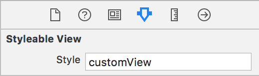

#  Stylist 🎨

[](https://circleci.com/gh/yonaskolb/Stylist)

[](https://github.com/Carthage/Carthage) [](https://cocoapods.org/pods/Stylist)
[](https://github.com/yonaskolb/Stylist/blob/master/LICENSE)

Stylist lets you define UI styles in a hot-reloadable external yaml or json theme file

- ✅ Define styles in **external theme files**
- ✅ Apply styles **programmatically** or via **Interface Builder**
- ✅ **Hotload** themes to see results immediately without recompiling
- ✅ Apply styles to any **UIView**, **UIViewController**, **UITabBar**, and your own **custom** classes
- ✅ Apply styles by style **names** or **classes**
- ✅ Apply styles when contained in certain view **hierarchies**
- ✅ **Swap** entire themes on the fly
- ✅ Built in style properties for all popular **UIKit** classes
- ✅ Reference **Theme variables** for commonly used values
- ✅ Include styles **within other styles**
- ✅ Define **custom** strongly typed properties and custom parsing to dynamically set any property

Example theme:

```yaml
variables:
  primaryColor: "DB3B3B" # hex color
  headingFont: Ubuntu # reference loaded font
styles:
  MyApp.MyViewController: # applied to MyViewController class
    view: # access the view
      tintColor: $primaryColor # reference a variable
    navigationBar: # access the navigation bar
      barTintColor: red # use color name
      titleColor: white
  UIButton:
    backgroundImage: buttonBack # set image
    backgroundImage:highlighted: buttonBack-highlighted # for highlighted control state
  MyApp.Section:
    styles: [themed] # include other styles
    axis(horizontal:regular): horizontal # restrict by size class
    axis(horizontal:compact): vertical
  MyApp.Section UIStackView UILabel: # View containment selector
    textAlignment: right # use enums
  primaryButton:
    textColor: "55F" # shorted hex value
    contentEdgeInsets: [10,5] # set simplified UIEdgeInsets
    font(device:iphone): $headingFont:16 # reference font variable and change size
    font(device:ipad): $headingFont:22 # restrict to device
  secondaryButton:
    cornerRadius: 10 # set layer properties
    textColor: customColor # use named color
    font: 20 # use system font
    contentEdgeInsets: 6 # set UIEdgeInsets using a single value
  sectionHeading:
    font: title 2 # use UIFontTextStyle
    font: darGray:0.5 # built in color with alpha
  content:
    font: Arial:content # Use custom font with UIFontTextStyle
  themed: # style is referenced in other styles
    tintColor: $primaryColor
```
- [⬇️ Installing](#installing)
- [⚒ Usage](#usage)
  - [Loading a Theme](#loading-a-theme)
  - [Setting a Style](#setting-a-style)
  - [Hot Reloading](#hot-reloading)
- [🎨 Theme](#theme)
  - [Style Selectors](#style-selectors)
  - [Styles References](#style-references)
  - [View hierarchy styles](#view-hierarchy-styles)
  - [Style Context](#style-context)
- [🖌 Style Properties](#style-properties)
- [⚙️ Custom Properties](#custom-properties)
- [⚙️ Custom Styleable class](#custom-styleable-class)

## ⬇️ Installing

### Cocoapods
Add the following to your `podfile`

```sh
pod 'Stylist'
```

### Carthage
Add the following to your `Cartfile`
```sh
github "yonaskolb/Stylist"
```

## ⚒ Usage

Make sure to import Stylist

```swift
import Stylist
```

### Loading a Theme
To load a Theme use:

```swift
Stylist.shared.load(path: pathToFile)
```

You can load multiple themes, and they will all be applied as long as they have different paths.

You can also load a Theme manually and then add it by name, allowing you to swap themes at runtime.

```swift
let theme = try Theme(path: pathToTheme)
Stylist.shared.addTheme(theme, name: "mainTheme")
```

### Setting a Style
Class styles will be applied to `UIView` when they are added to a superview, and to `UIViewController` when `viewDidLoad()` is called.

To set a custom style on a Styleable class, simply set its `style` property. You can set multiple styles by comma separating them.

#### Programmatically

```swift
myView.style = "myStyle"
otherView.style = "myStyle,otherStyle"
```

#### Interface Builder

Styles can be set in Interface Builder in the property inspector



### Hot Reloading
You can choose to watch a Theme files which means that whenever that file is changed the styles are reloaded. These changes can also be animated!

Themes can live at a remote url allowing you to update styles remotely.

Hotloading can be very useful while developing, as you can make changes to your styles on the fly without recompiling and see the results animate in instantly! To watch a file simply call `watch` on stylist and pass in a URL to a local file on disk or a remote url:

```swift
Stylist.shared.watch(url: fileOrRemoteURL, animateChanges: true) { error in
  print("An error occurred while loading or parsing the file: \(error)")
}
```
If an error occurs at any time the `parsingError` callback will be called with a `ThemeError`, which will tell you exactly what went wrong including any formatting errors or invalid references. This means if you accidentally save an invalid theme you don't have to worry that your app will blow up.

To stop watching the file, you can call `stop()` on the `FileWatcher` that is returned.

> Note that if a style property was present and you then remove it, Stylist cannot revert the change so that property will remain in the previous state.

## 🎨 Theme

A Theme file has a list of `variables` and a list of `styles`.
Variables can be referenced in styles using `$variableName`.

Styles are defined by [selector](#selectors), and are a map of [properties](Docs/StyleProperties.MD#properties) to [values](Docs/StyleProperties.MD#types)


```yml
variables:
  primaryColor: "DB3B3B"
styles:
  primary:
    color: $primaryColor
```

### Style Selectors
Styles are defined using one or more selectors. Selectors can be a class or a style name or both. Custom classes must be prefixed by the module name. Style names must start with a lowercase.

For example:

- `UIButton` all UIButtons
- `MyApp.MyView` all MyView classes in the MyApp Module
- `UITabBar.primary` all tab bars with the primary style
- `primary` all styleables with the primary style

There can be multiple selectors separated by a space, which then check if the later selectors are contained in the earlier selectors. This only applies to UIViews and UIViewControllers. The containers don't have to be direct superviews but can be further up the responder chain.

For example, the following style will be applied to any `UIButton` that is contained within a view with a `section` style, that is within a `UIStackView` with the `main` style, and then within a `UINavigationController`.

```yaml
styles:
  UINavigationController UIStackView.main section UIButton:
    font: title3
```

Styles will be applied in order of specificity, so the more specific a style is (more selectors), the later it will be applied.

### Style references

Each style may also have a `styles` array that is an array of other inherited styles, who's properties will also be applied without overwriting anything.

```yml
styles:
  primary:
    styles: [themed]
  themed:
    tintColor: red
    backgroundColor: EEEEEE
```

### View hierarchy styles

Styles can reference the view hierarchy and then style that with its own properties. This is really useful for testing or accessing parts of the view hierarchy easily (`UIViewController.view` for example)

The sub styles are available on the following types:

- **UIView**
	- `superview`: The superview
	- `next`: The next sibling view
	- `previous`: The previous sibling view
	- `viewController`: The view controller the view belongs to
- **UIViewController**
	- `view`: The root view
	- `parent`: The parent view controller
	- `navigationController`: The UINavigationController this is contained in
	- `tabBarController`: The UITabBarController this is contained in
	- `tabBar`: The UITabBar for this view controller. Can be accessed on any child view controller
	- `navigationBar`: The UINavigationBar for this view controller. Can be accessed on any child view controller

```yml
styles:
  MyApp.MyViewController:
    view:
      tintColor: red
    navigationBar:
      tintColor: red
```

### Style Context
Style properties can be restricted to a certain context, for example a certain control state or trait collection. This is similar to how CSS media queries work. See [Context](Docs/StyleProperties.MD#context) for more info

```yml
styles:
  UIButton.primary:
    backgroundImage: buttonBack
    backgroundImage:highlighted: buttonBack-highlighted
  UIStackView.main:
    axis(horizontal:regular): horizontal
    axis(horizontal:compact): vertical
  title:
    font(device:iphone): $headingFont:16
    font(device:ipad): $headingFont:22
```

## 🖍 Style Properties
Many UIKit views and bar buttons have built in properties that you can set. These can be viewed in [Style Properties](Docs/StyleProperties.MD).

## ⚙️ Custom Properties
Custom properties and parsers can also be added to let you configure anything you wish in a strongly typed way.

To create a `StyleProperty` pass a name and a generic closure that sets the property. Make sure to provide types for the styleable class and the generic `PropertyValue`.

```swift
// creates a new property that is applies a TextTransform to a MyLabel
// access the property context and value via the PropertyValue
let property = StyleProperty(name: "textTransform") { (view: MyLabel, value: PropertyValue<TextTransform>) in
    view.textTransform = value.value
}

// adds the custom property to Stylist
Stylist.shared.addProperty(property)
```

The value must conform to `StyleValue` which is a simple protocol:

```swift
public protocol StyleValue {
    associatedtype ParsedType
    static func parse(value: Any) -> ParsedType?
}
```

The `PropertyValue` will have a `value` property containing your parsed value. It also has a `context` which contains the [property context](Docs/StyleProperties.MD#context) like device type, UIControlState, UIBarMetrics, size classes..etc.

When a theme is loaded or when a style is set on a view, these custom properties will be applied if the view type and property name match.

Many different types of properties are already supported and listed here in [Style Property Types](Docs/StyleProperties.MD#types)

## ⚙️ Custom Styleable class
By default `UIView`, `UIViewController` and `UIBarItem` are styleable. You can make any custom class styleable as well by conforming to the `Styleable` protocol.
The inbuilt `Styleable` classes automatically call `applyStyles`, so you will have to do that automatically in your `styles` setter.

```swift
public protocol Styleable: class {
    var styles: [String] { get set }
}

extension Styleable {

    func applyStyles() {
        Stylist.shared.style(self)
    }
}
```

## 👥 Attributions

This tool is powered by:

- [KZFileWatchers](https://github.com/krzysztofzablocki/KZFileWatchers)
- [Yams](https://github.com/jpsim/Yams)

## 👤 Contributions
Pull requests and issues are welcome

## 📄 License

Stylist is licensed under the MIT license. See [LICENSE](LICENSE) for more info.
