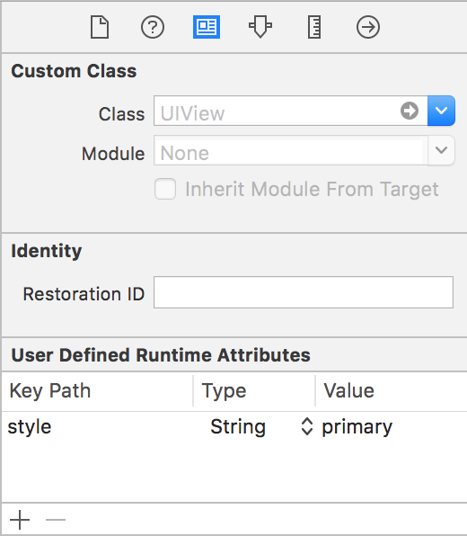

#  Stylist 🎨

[](https://circleci.com/gh/yonaskolb/Stylist)
[](https://github.com/yonaskolb/Stylist/blob/master/LICENSE)

Stylist lets you define UI styles in a hot-reloadable external yaml or json theme file

- ✅ Define styles in **external themes**
- ✅ Apply styles through code or **Interface Builder**
- ✅ **Hotload** themes to see results immediatly without recompiling
- ✅ Apply styles by style **names** or **classes**
- ✅ Styles can be applied to only certain view **heirachies**
- ✅ **Swap** entire themes on the fly
- ✅ Built in style properties for all popular **UIKit** classes
- ✅ Reference **Theme variables** for commonly used values
- ✅ Use **style inheritence**
- ✅ Define **custom** strongly type properties and custom parsing to set any property you wish
- ✅ Make your **own classes** styleable

Example theme:

```yaml
variables:
  primaryColor: "DB3B3B"
  headingFont: Ubuntu
styles:
  UIButton:
    backgroundImage: buttonBack
    backgroundImage:highlighted: buttonBack-highlighted
  MyApp.Section:
    styles: [themed]
    axis(horizontal:regular): horizontal
    axis(horizontal:compact): vertical
  MyApp.Section UIStackView UILabel:
    styles: [content]
  primaryButton:
    textColor: "55F"
    textColor:highlighted: white
    contentEdgeInsets: [10,5]
    font(device:iphone): $headingFont:16
    font(device:ipad): $headingFont:22
  secondaryButton:
    backgroundColor: $primaryColor
    cornerRadius: 10
    textColor: white
    font: 20
    contentEdgeInsets: 6
  sectionHeading:
    font: title 2
    color: darkGray
  content:
    font: Arial:content
    color: "1D1D1D"
  themed:
    tintColor: $primaryColor
```

## ⬇️ Installing

#### Cocoapods
Add the following to your `podfile`

```sh
pod 'Stylist'
```

#### Carthage
Add the following to your `Cartfile`
```sh
github "yonaskolb/Stylist"
```

## 🎨 Theme
A theme file has a list of `variables` and a list of `styles`.
Variables can be referenced in styles using `$variableName`.

To load a Theme simply call:

```swift
Stylist.shared.load(path: pathToFile)
```

You can load multiple themes, and they will all be applied as long as they have different paths.

You can also load a Theme manually and then add it by name, allowing you to swap themes at runtime.

```swift
let theme = try Theme(path: pathToTheme)
Stylist.shared.addTheme(theme, name: "mainTheme")
```

## 🖌 Style

Styles are defined using one or more selectors. Selectors can be a class or a style or both. Custom classes must be prefixed by the module name. 

- `UIButton` all UIButtons
- `MyApp.MyView` all MyView classes in the MyApp Module
- `UITabBar.primary` all tab bars with the primary style
- `primary` all views with the primary style

There can be multiple selectors seperated by a space, which then check if the later selectors are contained in the earlier selectors. This only applies to UIViews, and the containers don't have to be direct superviews but can be further up the chain.

For example, the following style will be applied to any `UIButton` this is contained within a view with a `section` style, that is then inside a `UIStackView` with the `main` style.

```yaml
styles:
  UIStackView.main section UIButton:
    font: title3
```

Each style may also have a `styles` array that is an array of other inherited styles, who's properties will also be applied.

### Setting a Style
To set a custom style on a UIView, simply set it's `style` property:

```swift
myView.style = "myStyle"
```

A style can also be set in Interface Builder in the identity inspector.


> You can also set a `styles` array that will apply multiple styles in order.

## 🖍 Style Properties
Many UIKit views and bar buttons have built in properties that you can set. These can be viewed in [Style Properties](Docs/StyleProperties.MD).
Each style can also reference an array of other styles that will be merged in order

## 🔥 Hot Reloading
You can choose to watch a file, which means that whever that file is changed the styles are reloaded. The file can be a local file on disk or a remote file.
This can be very useful while developing, as you can make changes on your device without recompiling and see the results instantly! To watch a file simply call `watch` on stylist and pass in a URL:

```swift
Stylist.shared.watch(url: fileOrRemoteURL, animateChanges: true) { error in
  print("An error occured while loading or parsing the file")
}
```
If an error occurs at any time the `parsingError` callback will be called with a `ThemeError`, which will tell you exactly what went wrong including any formatting errors on invalid references. This means you can save an invalid theme without worrying that things will blow up.

To stop watching the file, you can call `stop()` on the `FileWatcher` that is returned.

Note that if a style property was present and you then remove it, Stylist cannot revert the change so that property will remain in the previous state.

## ⚙️ Custom Properties
Custom properties and parsers can also be added to let you configure anything you wish in a strongly typed way:

```swift
Stylist.shared.addProperty("textTransform") { (view: MyView, value: PropertyValue<MyProperty>) in
    view.myProperty = value.value
}
```
`addProperty` takes a style name a simply generic closure that sets your property on your view. This closure can contain any other logic you wish. The view can be NSObject and the property must conform to `StyleValue` which is a simply protocol:

```swift
public protocol StyleValue {
    associatedtype ParsedType
    static func parse(value: Any) -> ParsedType?
}
```

Many different types of properties are already supported and listed here in [Style Property Types](Docs/StyleProperties.MD#types)

The `PropertyValue` that get's passed into the closure will have a `value` property containing your parsed value. It also has a `context` which contains [property query values](Docs/StyleProperties.MD#queries) like device type,  UIControlState and UIBarMetrics.

When a theme is loaded or when a style is set on a view, these custom properties will be applied if the view type and property name match.

## ⚙️ Custom Styleable class
By default `UIView` and `UIBarItem` are styleable. You can make any custom class styleable as well by conforming to the `Styleable` protocol.
`UIView` and `UIBarItem` automatically call `applyStyles`, so you will have to do that automatically in your `styles` setter.

```swift
public protocol Styleable: class {
    var styles: [String] { get set }
}

extension Styleable {

    func applyStyles() {
        Stylist.shared.style(self)
    }
}
```

## 👥 Attributions

This tool is powered by:

- [KZFileWatchers](https://github.com/krzysztofzablocki/KZFileWatchers)
- [Yams](https://github.com/jpsim/Yams)

## 👤 Contributions
Pull requests and issues are welcome

## 📄 License

Stylist is licensed under the MIT license. See [LICENSE](LICENSE) for more info.
